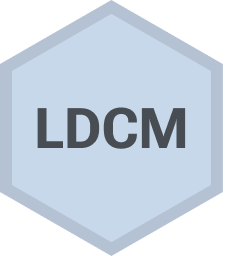

<!-- README.md is generated from README.Rmd. Please edit that file -->

# Longitudinal Diagnostic Classification Models 

<!-- badges: start -->

<a href="https://cran.r-project.org/package=ldcm"
class="pkgdown-release"></a>
[](https://github.com/cotterell/ldcm/actions/workflows/check-standard.yaml)
[](https://github.com/cotterell/ldcm/actions/workflows/pkgdown.yaml)
<!-- badges: end -->

The R package **ldcm** provides a multilevel extension to the
longitudinal diagnostic classification model (DCM) to help researchers
take into account contextual effects that can impact the fidelity and
effectiveness of an educational intervention. Learn more in
`vignette("ldcm")`.

## Installation

<div class=".pkgdown-release">

``` r
# Install released version from CRAN
install.packages("ldcm")
```

</div>

<div class=".pkgdown-devel">

``` r
# Install development version from GitHub
devtools::install_github("cotterell/ldcm")
```

</div>
